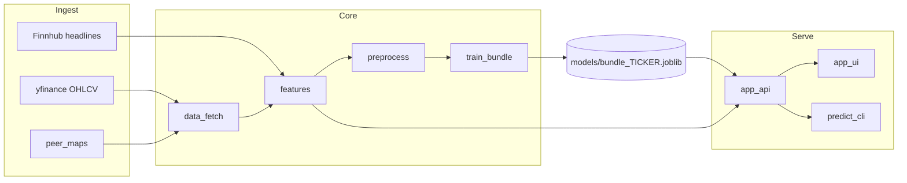

# ML Project — Stock Direction & Feature Engineering

End-to-end pipeline: download market data, engineer a wide feature table (technicals, macro, peers, dividends, news sentiment), train a classifier, and serve predictions via API, CLI, or Streamlit.

**Scope:** Coursework / research-style dataset and demo. This is **not** investment advice; predictive performance on daily direction is inherently difficult and should be reported honestly.

---

## Quick start

```bash
cd "/path/to/ML Project Stock Prediction"
python -m venv .venv
source .venv/bin/activate          # Windows: .venv\Scripts\activate
pip install -r requirements.txt

python scripts/run.py setup          # once: creates .env — paste your Finnhub key there
# Edit .env:  FINNHUB_API_KEY=abc123...   (no export needed in future terminals)
```

**One command runner** (loads `.env` automatically; no `export` each time):

```bash
python scripts/run.py pipeline MSFT    # check Finnhub → train if needed → predict
python scripts/run.py predict MSFT --compact
python scripts/run.py train MSFT --period 5y
python scripts/run.py export MSFT -o features_MSFT.csv
python scripts/run.py api              # terminal 1
python scripts/run.py ui               # terminal 2
```

Or with Make: `make pipeline TICKER=MSFT`, `make predict`, `make compare`, `make api`.

**Training period:** `train` saves `period` inside `models/bundle_{TICKER}.joblib`; `/predict` uses that same window (no more 5y train / 10y eval mismatch).

**Compare periods (coursework table):**

```bash
python scripts/run.py compare MSFT
# optional: models/bundle_MSFT_5y.joblib etc.
python scripts/run.py compare MSFT --save-bundles
python scripts/run.py compare-losses MSFT --period 5y   # MAE vs RMSE vs Huber
```

**Sentiment cache:** Finnhub headlines + FinBERT scores + daily `Daily_Sentiment` are stored under `data/cache/{TICKER}/` (gitignored). First run is slow; same-day reruns reuse cache. Refresh tomorrow or delete `data/cache/MSFT/` to refetch.

Legacy commands still work (`PYTHONPATH=. python -m src.train_bundle MSFT`, etc.).

---

## Architecture



**Label:** `Target_Next_Adj_Close` = next session adjusted close (regression). Training minimizes **MAE** (mean absolute price error). **Direction** and **% change** are derived at inference from predicted vs today’s close.

**Inference:** Latest feature row → scaled → XGBoost regressor → predicted next price, % change, Up/Down.

---

## Repository layout

| Path | Role |
|------|------|
| [`src/data_fetch.py`](src/data_fetch.py) | Yahoo alignment (target, benchmark, `^TNX`), peers, Finnhub headlines |
| [`src/features.py`](src/features.py) | Feature engineering + FinBERT sentiment → `Daily_Sentiment` |
| [`src/peer_maps.py`](src/peer_maps.py) | Static competitor / partner ticker lists |
| [`src/preprocess.py`](src/preprocess.py) | X/y split, chronological train/val/test, scaling |
| [`src/train_bundle.py`](src/train_bundle.py) | Train XGBoost regressor (next-day adj. close) → `models/bundle_{TICKER}.joblib` |
| [`src/evaluate.py`](src/evaluate.py) | Metrics and simple open→close backtest |
| [`src/models/`](src/models/) | Model helpers (`baseline_model`, optional DL utils) |
| [`app_api.py`](app_api.py) | FastAPI: `/health`, `/predict` |
| [`app_ui.py`](app_ui.py) | Streamlit dashboard |
| [`scripts/predict_cli.py`](scripts/predict_cli.py) | Terminal JSON (in-process or `--http`) |
| [`scripts/export_feature_dataset.py`](scripts/export_feature_dataset.py) | Export engineered CSV for reports |
| [`docs/roadmap_todo.py`](docs/roadmap_todo.py) | Comment-only roadmap: model comparison + regression refactor checklist |
| [`docs/FEATURES_REPORT.md`](docs/FEATURES_REPORT.md) | Full feature catalog and quarterly data notes |
| [`models/`](models/) | Trained bundles (gitignore large `.joblib` in real repos) |

Add new capabilities by extending `src/` and optional `scripts/`; keep this table updated.

---

## Environment variables

| Variable | Required | Purpose |
|----------|----------|---------|
| `FINNHUB_API_KEY` | For real news sentiment | Finnhub `company_news` headlines |
| `API_URL` | No | Streamlit / CLI HTTP mode (default `http://127.0.0.1:8000`) |
| `HF_TOKEN` | No | Optional; faster Hugging Face downloads for FinBERT |

Use a **local** `.env` file (see `.env.example`) or `export FINNHUB_API_KEY=...`. `scripts/run.py` loads `.env` automatically. Do not commit `.env` or hardcode keys in Python files.

---

## Training & evaluation split

Chronological (no shuffle), default fractions in [`src/preprocess.py`](src/preprocess.py):

| Block | Share | Use |
|-------|-------|-----|
| Train | 70% | Fit XGBoost |
| Validation | 15% | Early stopping (log-loss) |
| Test | 15% | Held-out metrics + API backtest |

Price history length is set by Yahoo `period` (default `10y` in training). **News sentiment** is fetched for a **rolling calendar window** (see `fetch_finnhub_news_headlines` / `_compute_daily_sentiment_scores`); older rows get `Daily_Sentiment = 0` after join unless you extend history + caching.

---

## How to run

### 1. Train

```bash
PYTHONPATH=. python -m src.train_bundle TICKER [--benchmark QQQ] [--period 10y] [--out-dir models]
```

Produces `models/bundle_{TICKER}.joblib` (`model`, `scaler`, `feature_columns`, metadata).

**Retrain** after changing features or `feature_columns`; old bundles will not match new columns.

### 2. API

```bash
PYTHONPATH=. uvicorn app_api:app --reload --host 127.0.0.1 --port 8000
```

- `GET /health`
- `POST /predict` — body: `{"ticker": "MSFT", "benchmark": "QQQ"}`
- Interactive docs: `http://127.0.0.1:8000/docs`

**`/predict` backtest fields (test window only):**

| Field | Meaning |
|-------|---------|
| `cumulative_return_strategy` | Model: in cash when Down, else next session open→close |
| `cumulative_return_open_to_close_benchmark` | Always take next session open→close (not buy-and-hold) |
| `cumulative_return_buy_and_hold` | Buy at first test `target_Adj Close`, sell at last (`exit/entry − 1`) |
| `buy_and_hold_entry_date` / `exit_date` / `entry_price` / `exit_price` | Anchors for true buy-and-hold |

### 3. Streamlit UI

```bash
streamlit run app_ui.py
```

Requires the API running unless you only use charts from Yahoo in the UI (predictions still call `/predict`).

### 4. CLI

```bash
# In-process (no uvicorn): runs fetch + FinBERT + model
python scripts/predict_cli.py MSFT --compact

# Via running API
python scripts/predict_cli.py MSFT --http --compact
```

### 5. Export feature table (CSV)

```bash
python scripts/export_feature_dataset.py MSFT -o features_MSFT.csv --period 5y
python scripts/export_feature_dataset.py MSFT -o out.csv --no-peer-maps   # skip peer columns in fetch
```

---

## Feature families (current)

Features are built in [`engineer_features()`](src/features.py). Non-exhaustive list — **add rows here when you add columns**:

| Family | Examples | Source module |
|--------|----------|----------------|
| Returns & macro | `daily_return`, lags, `relative_return_vs_benchmark`, `treasury_yield_daily_change` | `features` |
| Technicals | `rsi_14`, `macd`, `bollinger_bandwidth`, `atr_14_normalized`, `return_volatility_20d` | `features` + pandas-ta |
| News sentiment | `Daily_Sentiment` (−1 / 0 / +1 daily mean) | Finnhub + FinBERT |
| Quarterly reports | `qtr_earnings_surprise_pct`, `qtr_net_margin`, `qtr_roe_ttm`, … | [`fundamentals_fetch`](src/fundamentals_fetch.py) |
| Dividends / splits | `exdiv_flag`, `exdiv_lag1`, `div_sum_*`, `trailing_div_yield_lag1`, … | `features` |
| Peers | `comp_*`, `supp_*`, `ll_comp_*`, `ll_supp_*` | `data_fetch` + `peer_maps` |

**Sentiment mapping:** FinBERT positive → `1`, neutral → `0`, negative → `−1`. Finnhub headlines use a **365-day** fetch window; each trading day gets the mean score of articles published in the prior **14 calendar days** (includes weekend news). Older history rows stay `0` if no articles fall in that window.

**Quarterly reports:** EPS surprise / beat from `company_earnings`; margins and leverage from `company_basic_financials` (`series.quarterly`). Values are attached only after **quarter-end + 45 calendar days** (configurable `report_lag_days`) to reduce lookahead. Cached under `data/cache/{TICKER}/`.

---

## Data sources

| Source | Data | Notes |
|--------|------|--------|
| [Yahoo Finance](https://finance.yahoo.com/) via `yfinance` | OHLCV, dividends, splits | `period` e.g. `10y`, `5y` |
| [Finnhub](https://finnhub.io/) | News, quarterly earnings, basic financials | Requires API key |
| Hugging Face | `ProsusAI/finbert` | Downloaded on first sentiment run |
| Static maps | Competitors / partners | [`src/peer_maps.py`](src/peer_maps.py) |

---

## Extending the project

Use this checklist when adding “a lot more stuff”:

1. **New raw series** — Join in [`fetch_aligned_market_data()`](src/data_fetch.py) on `Date` (left join on target calendar; forward-fill sparingly).
2. **New derived columns** — Add in [`engineer_features()`](src/features.py); document leakage rules (only information known at row `t`’s close).
3. **New tickers for peers** — Edit [`COMPETITOR_MAP` / `PARTNER_MAP`](src/peer_maps.py).
4. **New external APIs** — New module under `src/` (e.g. `src/news_sentiment.py`), env var for keys, optional disk cache under `data/cache/` (gitignored).
5. **New models** — Extend [`src/models/`](src/models/) and [`train_bundle.py`](src/train_bundle.py); keep saving `feature_columns` in the bundle.
6. **New entrypoints** — Add scripts under `scripts/`; document commands in this README.
7. **Split policy** — If you switch to “last 2 years = test”, change [`chronological_train_val_test_split`](src/preprocess.py) **and** the matching logic in [`app_api.py`](app_api.py) backtest.

After any change to feature names: **retrain** and update exported CSVs / report figures.

---

## Artifacts

`models/bundle_{TICKER}.joblib` contains:

- `model` — fitted `XGBClassifier`
- `scaler` — `StandardScaler` fit on train only
- `feature_columns` — ordered list used at inference
- `ticker`, `benchmark` — metadata

---

## Troubleshooting

| Symptom | Likely cause |
|---------|----------------|
| `Daily_Sentiment` always 0 | Missing/invalid `FINNHUB_API_KEY` (not set in the **same shell** as `python`), Finnhub returning no headlines, or export dropping the last row (no `Target_Direction`). Use `python scripts/check_finnhub.py MSFT` to verify. |
| 503 on `/predict` | No `models/bundle_{TICKER}.joblib` — run `train_bundle` |
| Feature column mismatch | Retrain after adding features |
| Slow first run | FinBERT + Hugging Face model download |
| sklearn version warning on load | Retrain bundle with current sklearn |

---

## License & disclaimer

Academic / educational use. Market data and news are subject to provider terms. Past performance and backtests do not guarantee future results.
