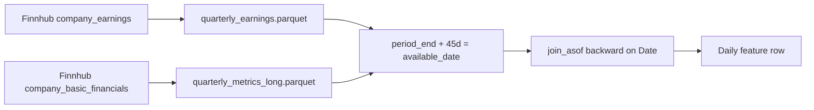

# Feature catalog — stock direction prediction pipeline

This document lists every column produced by `engineer_features()` in `src/features.py` that enters model training (plus the label). Counts for **peer** columns depend on the target ticker (see `src/peer_maps.py`).

**Example (MSFT, 2y history):** 49 model inputs + `Target_Direction` + `Date`.

To regenerate the exact column list for your ticker:

```bash
python scripts/run.py export MSFT -o /tmp/features_MSFT.csv --period 10y
# Inspect header row, or:
python -c "
from src.project_env import load_project_env
load_project_env()
from src.data_fetch import fetch_aligned_market_data
from src.features import engineer_features
raw = fetch_aligned_market_data('MSFT', 'QQQ', period='10y')
f = engineer_features(raw, target_ticker='MSFT')
print([c for c in f.columns if c not in ('Date',)])
"
```

---

## Label (not a model input)

| Column | Type | Definition | Information cutoff |
|--------|------|------------|-------------------|
| `Target_Direction` | 0 / 1 | `1` if next session `target_Adj Close` > today’s `target_Adj Close`, else `0` | Uses **next** day’s close → last row dropped in training unless `keep_incomplete_target=True` |

---

## 1. Returns & macro (13 columns)

| Column | Source | Definition | Cutoff |
|--------|--------|------------|--------|
| `daily_return` | Yahoo target | `Adj Close_t / Adj Close_{t-1} - 1` | Through close of day *t* |
| `daily_return_lag_3` | derived | `daily_return` shifted 3 sessions | Through *t−3* |
| `daily_return_lag_5` | derived | `daily_return` shifted 5 sessions | Through *t−5* |
| `relative_return_vs_benchmark` | Yahoo | `daily_return - benchmark_daily_return` (benchmark = e.g. QQQ) | Through close *t* |
| `return_volatility_20d` | derived | 20-day rolling std of `daily_return` (`min_samples=20`) | Through close *t* |
| `treasury_yield_daily_change` | Yahoo `^TNX` | Daily change in macro close (10Y yield proxy) | Through close *t* |
| `rsi_14` | pandas-ta | 14-period RSI on target OHLC | Through close *t* |
| `macd` | pandas-ta | MACD line (12, 26, 9) | Through close *t* |
| `macd_histogram` | pandas-ta | MACD histogram | Through close *t* |
| `macd_signal` | pandas-ta | MACD signal line | Through close *t* |
| `bollinger_bandwidth` | pandas-ta | Bollinger bandwidth | Through close *t* |
| `atr_14_normalized` | pandas-ta | ATR(14) / `Close` | Through close *t* |

**Raw inputs:** `fetch_aligned_market_data()` — target OHLCV, benchmark, `^TNX`, optional peer `pcomp_*` / `psupp_*` adj closes.

---

## 2. News sentiment (1 column)

| Column | Source | Definition | Cutoff |
|--------|--------|------------|--------|
| `Daily_Sentiment` | Finnhub + FinBERT | Mean FinBERT score of headlines with calendar date in `(Date − 14d, Date]`; scores mapped: positive=+1, neutral=0, negative=−1 | Headlines published on or before calendar day of session *t* (weekend news included in window) |

**Pipeline:** `fetch_finnhub_news_headlines` (30-day chunks, default 365 calendar days) → `ProsusAI/finbert` → `_sentiment_per_trading_session` → disk cache under `data/cache/{TICKER}/`.

If `target_ticker` is `None` or Finnhub key missing: column is `0.0`.

---

## 3. Quarterly reports (10 columns)

| Column | Finnhub origin | Definition | Cutoff |
|--------|----------------|------------|--------|
| `qtr_days_since_earnings` | `company_earnings` | Calendar days since `available_date` of latest joined earnings quarter | `available_date = period_end + 45d` |
| `qtr_earnings_surprise_pct` | `company_earnings` | `surprisePercent` from API (filled 0 if missing) | Same |
| `qtr_earnings_beat` | derived | `1.0` if `surprise > 0`, else `0.0` | Same |
| `qtr_eps_surprise_ratio` | derived | `eps_actual / eps_estimate - 1` (0 if \|estimate\| tiny) | Same |
| `qtr_eps` | `company_basic_financials` → `series.quarterly.eps` | Latest quarterly EPS point | `period_end + 45d` |
| `qtr_net_margin` | `series.quarterly.netMargin` | Net margin | Same |
| `qtr_gross_margin` | `series.quarterly.grossMargin` | Gross margin | Same |
| `qtr_operating_margin` | `series.quarterly.operatingMargin` | Operating margin | Same |
| `qtr_roe_ttm` | `series.quarterly.roeTTM` | Return on equity (TTM) | Same |
| `qtr_debt_to_equity` | `series.quarterly.totalDebtToEquity` | Debt / equity | Same |

**Modules:** `src/fundamentals_fetch.py`, `src/fundamentals_features.py` (`merge_quarterly_fundamentals`).

**Default lag:** `report_lag_days = 45` (stored in training bundle metadata). Disable with `engineer_features(..., use_fundamentals=False)`.

See [Quarterly extraction (detailed)](#quarterly-extraction-detailed) below.

---

## 4. Dividends & splits (9 columns)

| Column | Source | Definition | Cutoff |
|--------|--------|------------|--------|
| `exdiv_flag` | Yahoo `target_Dividends` | `1` on ex-dividend day (`Dividends > 0`) | Day *t* |
| `exdiv_lag1` | derived | `exdiv_flag` lagged 1 session | Through *t−1* |
| `div_sum_30_lag1` | derived | 30-day rolling sum of dividends, `.shift(1)` | Cash through *t−1* |
| `div_sum_252_lag1` | derived | 252-day rolling sum of dividends, `.shift(1)` | Cash through *t−1* |
| `last_div_amount_lag1` | derived | Last dividend amount, forward-filled, `.shift(1)` | Through *t−1* |
| `post_exdiv_1d` | derived | `1` if yesterday was ex-div | Through *t−1* |
| `days_since_exdiv` | derived | Days since last ex-div (capped 365) | Through *t* |
| `trailing_div_yield_lag1` | derived | `div_sum_252_lag1 / Close_{t-1}` clipped [0,1] | Through *t−1* |
| `split_event_lag1` | Yahoo `target_Stock Splits` | `1` if split magnitude yesterday | Through *t−1* |


---

## 5. Competitor peers (`comp_*`)

Static list from `COMPETITOR_MAP` in `src/peer_maps.py`. For **MSFT**: AAPL, GOOGL, ORCL, CRM.

| Column pattern | Definition | Cutoff |
|----------------|------------|--------|
| `comp_peer_n` | Number of competitor tickers joined | — |
| `comp_eq_ret1_lag1` | Equal-weight mean of peer 1-day returns, `.shift(1)` | Peer closes through *t−1* |
| `comp_eq_ret5_lag1` | 5-day rolling sum of that mean, `.shift(1)` | Through *t−1* |
| `comp_eq_ret10_lag1` | 10-day rolling sum of that mean, `.shift(1)` | Through *t−1* |
| `comp_disp_ret1_lag1` | Cross-sectional std of peer 1-day returns, `.shift(1)` | Through *t−1* |
| `ll_comp_{SYMBOL}_ret1_lag1` | Each peer’s 1-day return, `.shift(1)` | Through *t−1* |

---

## 6. Partner / supply peers (`supp_*`)

From `PARTNER_MAP`. For **MSFT**: NVDA, AMD, INTC, ORCL.

| Column pattern | Definition | Cutoff |
|----------------|------------|--------|
| `supp_peer_n` | Number of partner tickers | — |
| `supp_eq_ret1_lag1` | Equal-weight mean 1d return, lagged | Through *t−1* |
| `supp_eq_ret5_lag1` | 5d sum of mean return, lagged | Through *t−1* |
| `supp_eq_ret10_lag1` | 10d sum of mean return, lagged | Through *t−1* |
| `supp_disp_ret1_lag1` | Dispersion of peer 1d returns, lagged | Through *t−1* |
| `ll_supp_{SYMBOL}_ret1_lag1` | Per-partner 1d return, lagged | Through *t−1* |

If a peer ticker has no price column in the raw frame, it is omitted from aggregates.

---

## Columns **not** passed to the model

These may exist on the aligned raw frame from `data_fetch` but are **not** in `feature_cols`:

- Raw OHLCV: `target_*`, `benchmark_*`, `macro_*`
- Peer price columns: `pcomp_{SYM}_Adj Close`, `psupp_{SYM}_Adj Close`
- Intermediate TA columns from pandas-ta (only the six renamed series above are kept)

---

## Missing data policy

- After feature build, rows with **any null** in feature columns (and `Target_Direction` when training) are dropped (`drop_nulls`).
- NaNs in float features are converted to null then dropped with the row.
- Finnhub / fundamentals unavailable → quarterly and sentiment columns default to `0.0` (earnings: `qtr_days_since_earnings = 999` when no history).

---

## Quarterly extraction (detailed)

### APIs used (Finnhub)

We do **not** parse SEC 10-Q PDFs. Quarterly data comes from two Finnhub REST endpoints (free tier; depth varies by plan):

#### A. Earnings surprises — `company_earnings`

**Code:** `fetch_finnhub_quarterly_earnings()` in `src/fundamentals_fetch.py`

1. Call `client.company_earnings(symbol, limit=40)`.
2. For each record, parse:
   - `period` → `period_end` (fiscal quarter-end date)
   - `actual`, `estimate`, `surprise`, `surprisePercent`
   - `quarter`, `year`
3. Deduplicate by `period_end`, sort ascending.
4. Cache: `data/cache/{TICKER}/quarterly_earnings.parquet`

#### B. Fundamental ratios — `company_basic_financials`

**Code:** `fetch_finnhub_quarterly_metrics()` in `src/fundamentals_fetch.py`

1. Call `client.company_basic_financials(symbol, "all")`.
2. Read `response["series"]["quarterly"]` — a dict of metric name → list of `{period, v}` points.
3. Extract metrics: `eps`, `netMargin`, `grossMargin`, `operatingMargin`, `roeTTM`, `totalDebtToEquity`.
4. Store long format: `(period_end, metric, value)`.
5. Cache: `data/cache/{TICKER}/quarterly_metrics_long.parquet`

**Not used (403 on typical free tier):** Finnhub `financials` (full income statement).

### Leakage control — `available_date`

Finnhub does not always expose the exact earnings call timestamp in these endpoints. To avoid using information before the market could know it:

```text
available_date = period_end + report_lag_days   # default report_lag_days = 45
```

A quarterly value is only joinable to trading sessions with `Date >= available_date`.

### Joining to daily rows

**Code:** `merge_quarterly_fundamentals()` in `src/fundamentals_features.py`

1. Build one row per earnings quarter with derived fields:
   - `qtr_earnings_surprise_pct` ← `surprise_pct`
   - `qtr_earnings_beat` ← `surprise > 0`
   - `qtr_eps_surprise_ratio` ← `actual/estimate - 1`
2. **Earnings join:** Polars `join_asof` on `Date` ← `available_date`, `strategy="backward"` (latest quarter known as of that day).
3. **`qtr_days_since_earnings`:** `(Date - available_date)` in days.
4. **Metrics join:** For each metric, pivot long → panel with `available_date`, then repeated `join_asof` backward into the session calendar.
5. Left-join back to the full feature frame; nulls → `0.0`.



### Free-tier limitations

- `company_earnings` may return only the **last ~4 quarters**; older sessions keep zeros for surprise fields until more history is cached or plan upgraded.
- Metric series length depends on Finnhub coverage; missing metrics → column `0.0`.

### Configuration

| Parameter | Default | Where |
|-----------|---------|--------|
| `report_lag_days` | 45 | `DEFAULT_REPORT_LAG_DAYS`, bundle metadata |
| `use_fundamentals` | `True` | `engineer_features()` |
| `use_cache` | `True` | fundamentals fetch functions |

---

## Data source summary

| Family | Primary source |
|--------|----------------|
| Prices, dividends, splits | Yahoo Finance (`yfinance`) |
| Benchmark & macro | Yahoo (`QQQ`, `^TNX`) |
| Peers | Yahoo + `src/peer_maps.py` |
| News | Finnhub `company_news` |
| Sentiment model | Hugging Face `ProsusAI/finbert` |
| Quarterly earnings & ratios | Finnhub `company_earnings`, `company_basic_financials` |

---

*Generated for coursework reproducibility. Last aligned with pipeline code in `src/features.py`, `src/fundamentals_fetch.py`, `src/fundamentals_features.py`.*
